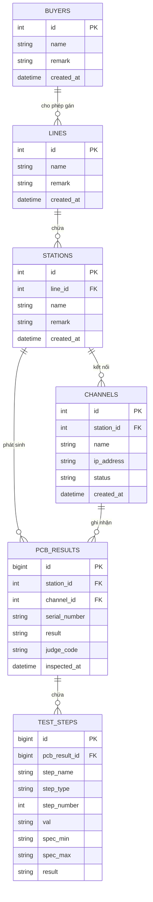

# 01. Software Requirements Specification (SRS) - PMSystem2

> **Tên hệ thống**: PMSystem2 - System Monitoring & PCB Quality Assurance System  
> **Khách hàng/Lĩnh vực**: Nhà máy chế tạo bo mạch điện tử (SMT & PCB Assembly)  
> **Trạng thái tài liệu**: Đã cập nhật cho kiến trúc .NET 8 / PostgreSQL (TimescaleDB)

---

## 🎯 1. Tổng Quan & Mục Tiêu Hệ Thống

### 1.1 Mục tiêu nghiệp vụ
Hệ thống **PMSystem2** được thiết kế để thay thế giải pháp giám sát cũ, giải quyết các thách thức về hiệu năng khi quy mô dữ liệu nhật ký kiểm tra PCB vượt mốc 8.6+ triệu bản ghi.
Hệ thống đóng vai trò làm **Trung tâm điều hành sản xuất & Chất lượng (Production Control Center)**:
* Thu thập dữ liệu kiểm tra thời gian thực từ các máy AOI, SPI, X-Ray, ICT, FCT.
* Phân tích và hiển thị trực quan các chỉ số KPI: Sản lượng (Inspected Volume), Số lượng Đạt (OK), Số lượng Lỗi (NG), Tỷ lệ Pass thật (First Pass Yield - FPY).
* Phân tích mã lỗi phổ biến (Defect Pareto) để đội ngũ kỹ thuật khắc phục sự cố tức thì.
* Quản lý thông tin Master Data danh mục: Khách hàng (Buyer), Dây chuyền (Line), Trạm kiểm tra (Station), Kênh thiết bị (Channel).

---

## ⚙️ 2. Yêu Cầu Chức Năng (Functional Requirements)

### 2.1 Quản Lý Master Data (Master Data Management)
* **Khách hàng (Buyers)**: Cho phép Thêm / Sửa / Xóa danh mục khách hàng.
* **Dây chuyền (Production Lines)**:
  * Cho phép Thêm / Sửa / Xóa dây chuyền sản xuất.
  * Tự động sắp xếp danh sách dây chuyền theo thứ tự tên tăng dần (Line 1-1, Line 1-2, Line 2-1,...).
* **Trạm kiểm tra (Stations)**:
  * Gắn liền với từng Dây chuyền sản xuất (`line_id`).
  * Cho phép Thêm / Sửa / Xóa trạm kiểm tra.
* **Kênh thu thập thiết bị (Hardware Channels)**:
  * Cho phép Thêm / Sửa / Xóa kênh phần cứng.
  * Hỗ trợ bộ lọc **Line** để chọn nhanh **Station** tương ứng khi cấu hình Channel.
  * Hiển thị đầy đủ thông tin tên Line, tên Station, Địa chỉ IP, **Địa chỉ MAC** và Trạng thái kết nối.
  * **Tự động đồng bộ Địa chỉ MAC (MAC Auto-Sync & Swap Detection)**: Khi máy collector gửi dữ liệu Đăng ký/Heartbeat lên Server, hệ thống tự động kiểm tra và cập nhật MAC address mới nếu phát hiện hoán đổi phần cứng, đồng thời phát thông báo SignalR cập nhật UI thời gian thực.
* **Quy tắc An toàn Dữ liệu (Cascading / Unassigned Handling)**:
  * Khi xóa Line/Station/Channel, hệ thống cập nhật liên kết về bản ghi fallback `Unassigned` (ID=0) thay vì xóa mất dữ liệu nhật ký kiểm tra PCB đã phát sinh trong quá khứ.

### 2.2 Thu Nhận & Xử Lý Dữ Liệu Sản Xuất (Telemetry Ingestion & Deduplication)
* Ghi nhận dữ liệu kiểm tra bo mạch PCB với tần suất cao (High-throughput Ingestion).
* Lưu trữ các thông số: Mã PCB (Barcode), Trạm kiểm tra (`station_id`), Kênh (`channel_id`), Kết quả chung (`PASS` / `FAIL`), Thời gian kiểm tra (`inspected_at` / `inspect_time`).
* Ghi nhận chi tiết từng bước kiểm tra (`test_steps`): Tên bước, thông số đo đạc (`value`), ngưỡng min/max, trạng thái bước (`PASS`/`FAIL`).
* **Cơ chế Chống Trùng Lặp Dữ Liệu (Multi-layered PCB Result Deduplication)**:
  * **Tầng Database (Unique Constraint)**: Đã tạo Unique Index `UX_pcb_results_station_pid_time_result` trên bộ 4 trường: `(station_id, pid, inspect_time, result)`.
  * **Tầng Dịch Vụ (Service Validation)**: `PcbService.SubmitResultAsync` tự động kiểm tra xem kết quả kiểm tra với cùng `StationId`, `PID`, `InspectTime`, và `Result` đã tồn tại chưa trước khi ghi DB.
  * **Xử lý An toàn**: Nếu phát hiện trùng lặp (ví dụ log file bị re-upload hoặc đẩy trùng), hệ thống tự động bỏ qua (ignore), ghi log cảnh báo và giữ nguyên chỉ số sản lượng / FPY thực tế mà không làm phình DB.

### 2.3 Hiển Thị Dashboard Trực Quan (Real-time Dashboard & Analytics)
* **Thống kê Tổng quan (KPI Cards)**: Tổng sản lượng, Số lượng OK, Số lượng NG, Tỷ lệ FPY.
* **Biểu đồ Sản lượng & Tỷ lệ Pass theo Thời gian**: Cho phép xem theo 24 giờ qua (Hourly), 7 ngày, 30 ngày.
* **Biểu đồ Defect Pareto**: Phân tích danh mục các mã lỗi xuất hiện nhiều nhất và ước tính chi phí thiệt hại.
* **Biểu đồ Sản lượng & Tỷ lệ Pass theo Dây chuyền**: So sánh dây chuyền hiệu quả và dây chuyền cảnh báo.
* **Biểu đồ Sản lượng & Tỷ lệ Pass theo Station (Top 10 Thấp Nhất)**: Nhận diện trạm kiểm tra có tỷ lệ NG cao nhất để hiệu chuẩn máy.
* **Ma trận Cảnh báo Rủi ro Trạm (Risk Matrix)**: Đánh giá trạm thuộc nhóm rủi ro Cao / Trung bình / Thấp dựa trên tỷ lệ lỗi.
* **Yêu cầu bắt buộc đối với dữ liệu**: **100% hiển thị từ DB thực tế, KHÔNG sử dụng dữ liệu mẫu tĩnh (hardcoded fallback)**.

---

## 📐 3. Mô Hình Dữ Liệu (Database ERD & Schema)

---

## 🌐 4. Danh Sách API Endpoints (REST API Specification)

### 4.1 Master Data APIs (`/api/v1/masterdata`)
* `GET /buyers` - Lấy danh sách Khách hàng
* `POST /buyers` - Tạo mới Khách hàng
* `PUT /buyers/{id}` - Cập nhật Khách hàng
* `DELETE /buyers/{id}` - Xóa Khách hàng
* `GET /lines` - Lấy danh sách Dây chuyền (Đã sắp xếp A-Z)
* `POST /lines` - Tạo mới Dây chuyền
* `PUT /lines/{id}` - Cập nhật Dây chuyền
* `DELETE /lines/{id}` - Xóa Dây chuyền
* `GET /stations` - Lấy danh sách Trạm kiểm tra
* `POST /stations` - Tạo mới Trạm kiểm tra
* `PUT /stations/{id}` - Cập nhật Trạm kiểm tra
* `DELETE /stations/{id}` - Xóa Trạm kiểm tra
* `GET /channels` - Lấy danh sách Kênh kết nối
* `POST /channels` - Tạo mới Kênh kết nối
* `PUT /channels/{id}` - Cập nhật Kênh kết nối
* `DELETE /channels/{id}` - Xóa Kênh kết nối

### 4.2 Production Analytics APIs (`/api/v1/production`)
* `GET /summary` - Thống kê KPI tổng quan sản lượng, OK, NG, Yield %
* `GET /stats/hourly` - Thống kê sản lượng theo từng giờ
* `GET /stats/line-yield` - Thống kê sản lượng và tỷ lệ đạt theo từng Dây chuyền
* `GET /stats/station-yield` - Thống kê sản lượng và tỷ lệ đạt theo từng Trạm kiểm tra
* `GET /stats/defect-pareto` - Thống kê phân tích tần suất mã lỗi (Defect Pareto)
* `POST /telemetry` - Tiếp nhận nhật ký kiểm tra PCB từ phần cứng / Collector
